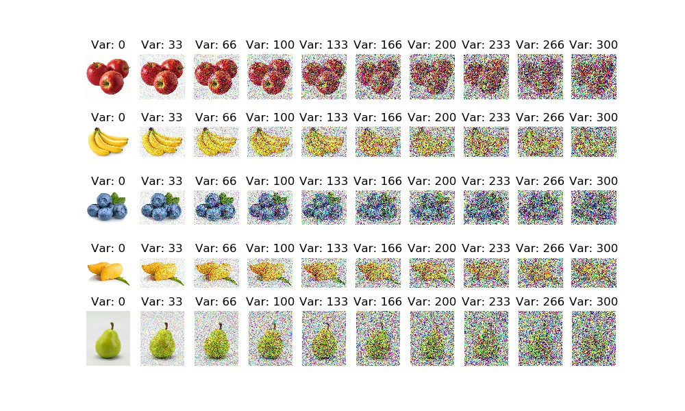
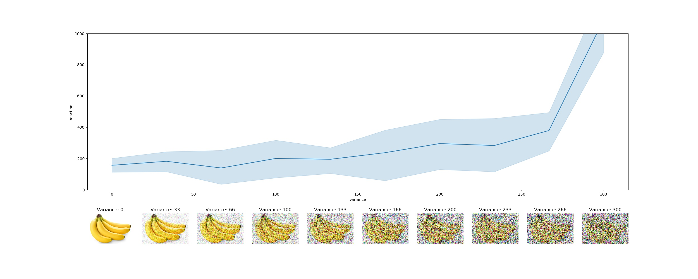
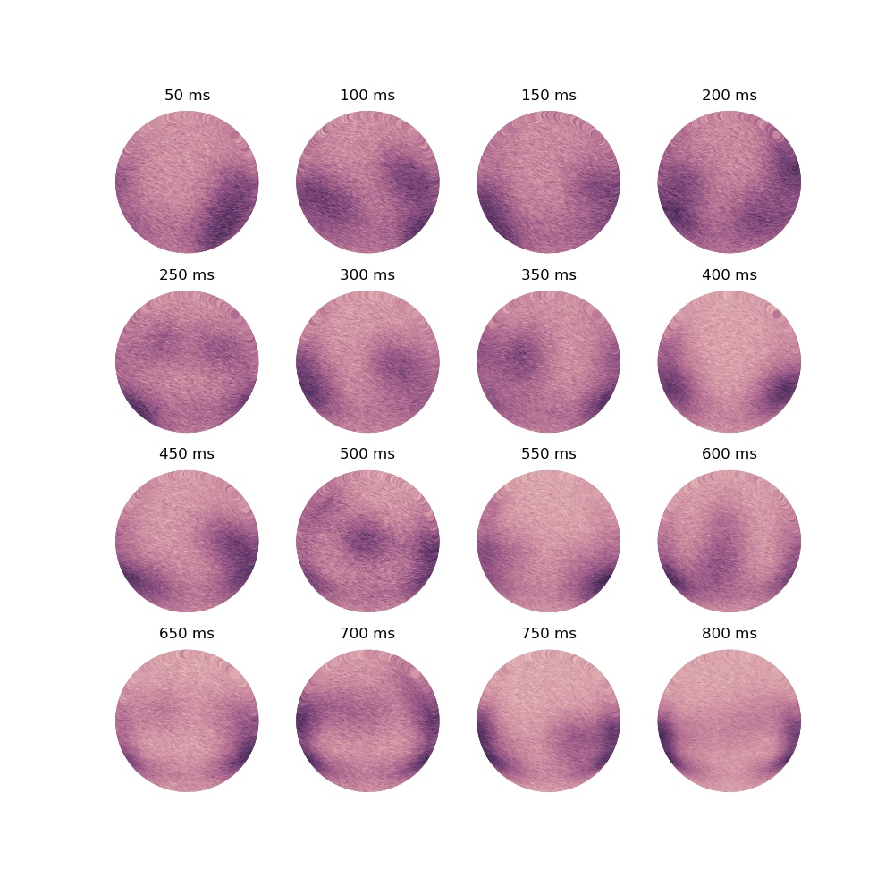
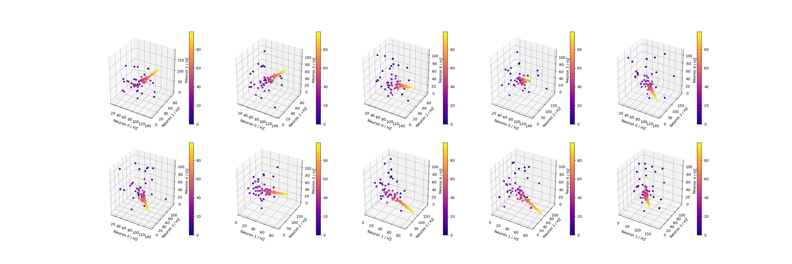
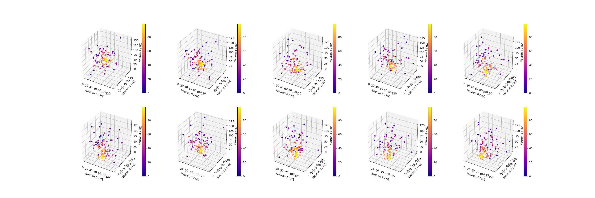
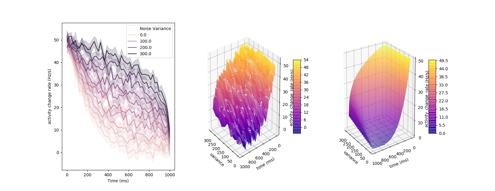

# neuro fake figure generator

Uses `seaborn`, `matplotlib`, `cv2`, `numpy` and `pandas` to generate the fake data for a fake-paper assignment for System Neurobiology @ Columbia.

- line plots with uncertainty 

- fake ERPs from brainscans

- neuro activity in subsets of 5 neurons

- 3d contour plots of acitivty change rate vs. image noise variance vs. time as a linear interpolation between two functions

